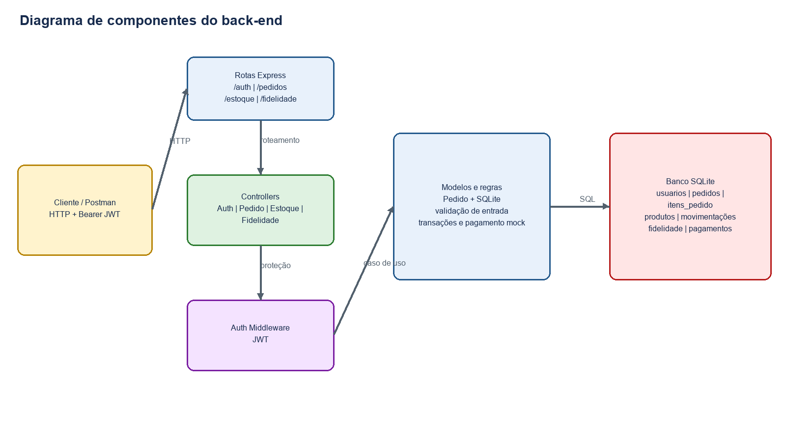
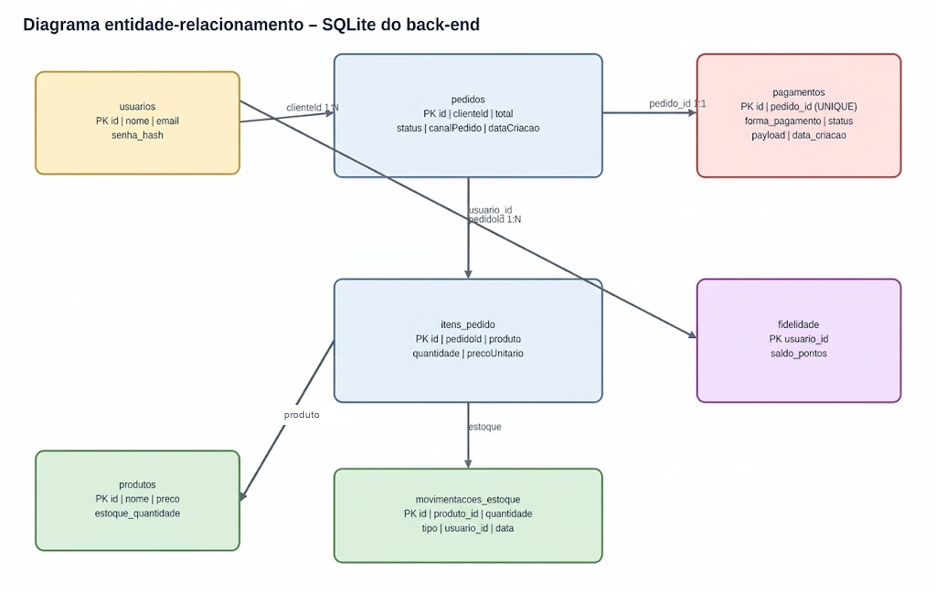
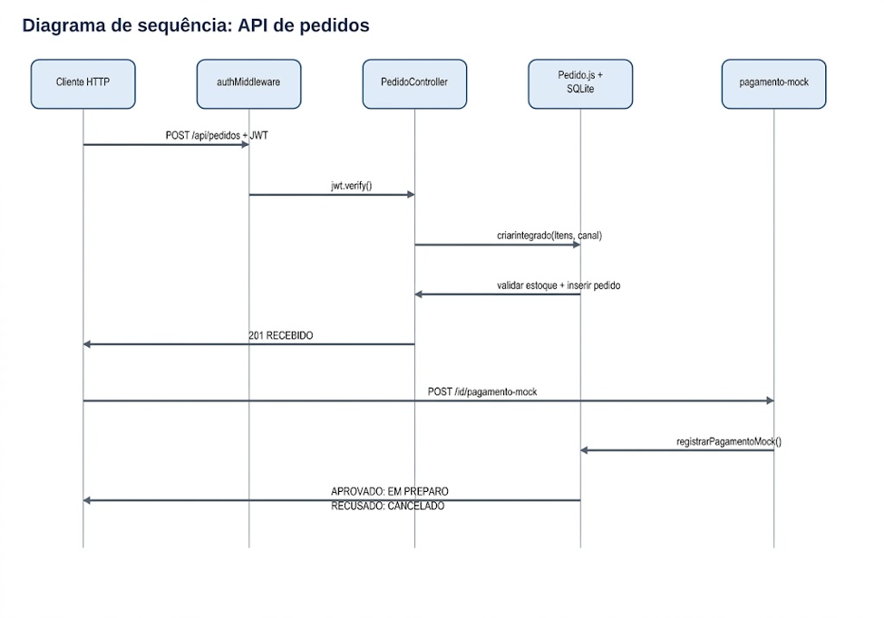

#Raízes do Nordeste

## Backend da plataforma de gestão de pedidos

Este repositório contém o backend do projeto multidisciplinar **Raízes do Nordeste**, desenvolvido para apoiar a organização de pedidos de pequenos produtores e cooperativas.

A aplicação disponibiliza uma API RESTful para registrar pedidos, validar seus itens, calcular o valor total e persistir os dados em um banco SQLite. A solução foi estruturada com separação de responsabilidades para facilitar a manutenção, os testes e futuras integrações com aplicações web, totens de atendimento e dispositivos móveis.

## Escopo atual

Nesta versão, o sistema concentra-se no fluxo de **autenticação, criação, consulta, atualização, pagamento mock e cancelamento controlado de pedidos**. Cada pedido possui um cliente, uma lista de itens, um canal de origem e um status de acompanhamento. Quando criado por usuário autenticado, o pedido também baixa o estoque e gera pontos de fidelidade.

## Objetivos

- Disponibilizar uma API simples e consistente para criação e consulta de pedidos.
- Separar apresentação, regras de negócio e persistência de dados.
- Validar informações recebidas antes da gravação no banco.
- Calcular o total do pedido a partir dos seus itens.
- Controlar o ciclo do pedido com os status `RECEBIDO`, `EM_PREPARO`, `PRONTO`, `ENTREGUE` e `CANCELADO`.
- Simular pagamentos aprovados e recusados, persistindo o resultado do pagamento.
- Manter uma base preparada para testes e futuras expansões.

## Evolução da solução

### V1: estrutura inicial

A primeira versão concentrava a configuração do servidor, as rotas e a lógica de criação de pedidos em uma estrutura reduzida. Essa abordagem facilitava o primeiro protótipo, mas aumentava o acoplamento e dificultava a manutenção.

### V2: arquitetura modular

A versão atual separa as principais responsabilidades da aplicação:

- **Aplicação:** configura o Express e os middlewares.
- **Rotas:** define os caminhos da API e aplica autenticação nas operações protegidas.
- **Controllers:** validam as requisições e coordenam os casos de uso.
- **Middleware:** valida tokens JWT.
- **Models:** realizam regras de negócio, transações e persistência no SQLite.
- **Testes:** verificam autenticação, pedidos, estoque, fidelidade e pagamento mock.

## Tecnologias

| Tecnologia | Utilização |
| --- | --- |
| Node.js 20 LTS | Ambiente de execução JavaScript |
| Express.js | Servidor HTTP e organização das rotas |
| SQLite3 | Persistência local dos pedidos |
| Helmet | Proteção de cabeçalhos HTTP |
| CORS | Controle de acesso entre origens |
| Jest | Execução dos testes automatizados |
| Supertest | Testes de integração da API |
| GitHub Actions | Execução remota da instalação e dos testes |

## Organização do projeto

```text
.
├── src/
│   ├── app.js                         # Configuração do Express e middlewares
│   ├── server.js                      # Inicialização do servidor
│   ├── controllers/                   # Auth, pedidos, estoque e fidelidade
│   ├── middleware/
│   │   └── authMiddleware.js          # Validação do JWT
│   ├── models/
│   │   └── Pedido.js                  # Regras e transações de pedidos
│   └── routes/                        # Auth, pedidos, estoque e fidelidade
├── tests/
│   └── pedido.test.js                 # Testes automatizados
├── init_db.js                         # Criação idempotente das tabelas
├── package.json                       # Dependências e comandos
├── database.sqlite                    # Banco local gerado pela aplicação
└── .github/workflows/tests.yml        # Pipeline de testes no GitHub
```

## Modelo de dados

O banco possui tabelas para usuários, pedidos, itens, produtos, estoque, fidelidade e pagamentos:

### `pedidos`

Armazena o cliente, o valor total, o status, o canal de pedido e a data de criação.

### `itens_pedido`

Armazena os produtos associados ao pedido, incluindo quantidade e preço unitário. A coluna `pedidoId` relaciona cada item ao seu pedido.

### `pagamentos`

Armazena o pagamento mock associado ao pedido, a forma de pagamento, o status, o payload e a data de criação.

### `usuarios`, `produtos`, `movimentacoes_estoque`, `fidelidade` e `historico_fidelidade`

Armazenam autenticação, catálogo/estoque, histórico de movimentações e pontuação de fidelidade.

## Endpoints disponíveis

### Autenticação

```http
POST /api/auth/register
POST /api/auth/login
```

O cadastro armazena a senha com hash e cria automaticamente uma conta de fidelidade com saldo inicial zero. O login devolve um token JWT; use-o nas rotas protegidas com o cabeçalho `Authorization: Bearer <token>`.

### Criar pedido

```http
POST /api/pedidos
Authorization: Bearer <token>
Content-Type: application/json
```

#### Requisição

```json
{
  "canalPedido": "APP",
  "clienteId": 123,
  "itens": [
    {
      "produtoId": 1,
      "quantidade": 2,
      "precoUnitario": 5.99
    }
  ]
}
```

`canalPedido` é obrigatório e aceita `APP`, `TOTEM`, `BALCAO`, `PICKUP` ou `WEB`.

#### Resposta de sucesso `201 Created`

```json
{
  "id": 1,
  "total": 11.98
}
```

#### Validações

A API rejeita requisições que não possuam cliente, que tenham a lista de itens vazia ou que contenham produto, quantidade ou preço inválidos. Nesses casos, retorna `400 Bad Request` com uma mensagem de erro em JSON. Todo pedido novo recebe o status `RECEBIDO`.

### Listar pedidos

```http
GET /api/pedidos
```

Essa rota não aplica autenticação no código atual. Retorna os pedidos cadastrados, incluindo seus itens, ordenados do mais recente para o mais antigo.
É possível filtrar pelo canal de origem:

```http
GET /api/pedidos?canalPedido=TOTEM
```

### Buscar pedido por identificador

```http
GET /api/pedidos/:id
```

Essa rota não aplica autenticação no código atual. Retorna um pedido específico. Quando o identificador não existe, a API responde com `404 Not Found`.

### Cancelar pedido

```http
PATCH /api/pedidos/:id/cancelamento
Authorization: Bearer <token>
```

Permite cancelar um pedido enquanto ele estiver com status `RECEBIDO`. A resposta será `409 Conflict` se o pedido já estiver em outro estado.

O cancelamento ocorre em transação: os itens retornam ao estoque e os pontos gerados são estornados. Se alguma etapa falhar, nenhuma alteração é confirmada.

### Atualizar status

```http
PUT /api/pedidos/:id
Authorization: Bearer <token>
```

Aceita os status `RECEBIDO`, `EM_PREPARO`, `PRONTO`, `ENTREGUE` e `CANCELADO`.

### Registrar pagamento mock

```http
POST /api/pedidos/:id/pagamento-mock
Authorization: Bearer <token>
Content-Type: application/json
```

#### Requisição

```json
{
  "formaPagamento": "PIX",
  "status": "APROVADO",
  "payload": {
    "transacao": "mock-123"
  }
}
```

O pagamento mock aceita `APROVADO` ou `RECUSADO`. Quando aprovado, o pedido passa
para `EM_PREPARO`. Quando recusado, o pedido passa para `CANCELADO`. O resultado
é persistido na tabela `pagamentos`.

### Excluir ou cancelar com estorno

```http
DELETE /api/pedidos/:id
Authorization: Bearer <token>
```

Para preservar o histórico, a exclusão lógica cancela o pedido e executa o estorno de estoque e pontos.

### Estoque

```http
POST /api/estoque/produtos
POST /api/estoque/movimentar
```

As rotas exigem autenticação. A movimentação aceita `ENTRADA` e `SAIDA`, impede saldo negativo e registra o histórico da operação.

### Fidelidade

```http
GET /api/fidelidade/saldo
POST /api/fidelidade/resgatar
```

As rotas exigem autenticação e permitem consultar ou resgatar pontos do usuário.

#### Resposta

```json
{
  "id": 1,
  "status": "CANCELADO"
}
```

## Execução local

> O ambiente precisa ter Node.js 20 ou versão compatível instalado.

```bash
npm install
npm run init-db
npm start
```

Por padrão, o servidor é disponibilizado em:

```text
http://localhost:3000
```

A porta pode ser alterada pela variável de ambiente `PORT`.

## Testes

Para executar os testes automatizados:

```bash
npm test
```

## Evidências para o roteiro

- Fluxo integrado de pedido, estoque e fidelidade: `tests/pedido.test.js`.
- Autenticação e token JWT: `tests/auth.test.js`.
- Pagamento mock, canal e filtro: testes de pedido e endpoint
  `POST /api/pedidos/:id/pagamento-mock`.
- Pipeline automatizado: `.github/workflows/tests.yml`.
- Coleção Postman: `docs/postman/raizes-nordeste.postman_collection.json`.
- Diagramas técnicos do back-end: `docs/diagramas-backend.md`.

O projeto ainda não possui Swagger/OpenAPI. A coleção Postman deve ser executada
depois de inicializar o banco e cadastrar um produto de estoque.

Os cenários cobrem a criação bem-sucedida de um pedido, a ausência do identificador do cliente, a validação de quantidade inválida, a listagem, a busca por identificador, o retorno de pedido inexistente e o cancelamento controlado.

O projeto também possui uma rotina em **GitHub Actions**. A cada alteração enviada ao branch `main`, o GitHub instala as dependências, inicializa o banco e executa os testes automaticamente.

## Qualidade e segurança

- Separação entre rotas, controllers e models.
- Validação dos dados de entrada.
- Uso de consultas parametrizadas no SQLite.
- Helmet habilitado para proteção dos cabeçalhos HTTP.
- CORS configurado para permitir a integração com clientes externos.
- Testes automatizados executados no pipeline do GitHub.
- Regra de negócio explícita para cancelamento somente no status `RECEBIDO`.
- Transação única para pedido, estoque e pontos, com rollback em caso de estoque insuficiente.
- Senhas armazenadas com hash bcrypt e sessões representadas por JWT.
- Controle de estoque com histórico de movimentações.
- Conta de fidelidade individual com histórico de resgates.

## Próximas etapas

- Adicionar documentação Swagger/OpenAPI.
- Avaliar gestão de unidades e cardápio por unidade.
- Implementar logs e auditoria de ações sensíveis.
- Criar regras de perfil/role além da autenticação por token.
- Expandir a cobertura de testes e anexar evidências das execuções.
- Integrar a API a uma interface web, totens ou aplicativo móvel.

## Contexto acadêmico

Projeto desenvolvido na disciplina de Projeto Multidisciplinar: Engenharia de Software, do curso de Análise e Desenvolvimento de Sistemas da UNINTER.

## Documentação complementar

O documento completo do projeto, com a fundamentação, a arquitetura, os exemplos de código e o plano de evolução, está disponível em [projeto-completo-backend-rede-raizes.md](docs/projeto-completo-backend-rede-raizes.md).

Os diagramas de componentes, entidade-relacionamento e sequência da API estão
disponíveis em [diagramas-backend.md](docs/diagramas-backend.md).

### Diagramas técnicos

Os diagramas abaixo representam somente o back-end implementado:

#### Componentes e fluxo interno



#### Modelo entidade-relacionamento do SQLite



O DER utiliza a coluna `produto` em `itens_pedido`, conforme a definição atual
da tabela em `init_db.js`.

#### Sequência da API de pedidos


